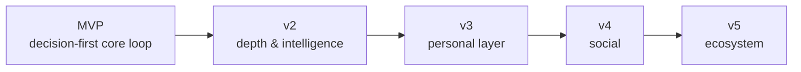

<div align="center">


<a href="#"></a>

<br/>


</div>

<br/>

## 🎟️ What is this

> **"I have 100,000 movies available and still don't know what to watch."**

CineRoulette solves exactly that, and nothing else. Set a mood and a filter or two — as few as one, as many as thirty — hit **Spin**, and get back **one** intelligently-weighted, explainable pick. Not a list. Not a browse screen. A decision.

<table>
<tr>
<td width="20%" align="center">🎯<br/><b>Decisive</b><br/><sub>one great pick beats twenty unranked ones</sub></td>
<td width="20%" align="center">🎭<br/><b>Mood-first</b><br/><sub>how you feel &gt; a genre dropdown</sub></td>
<td width="20%" align="center">🌍<br/><b>Truly global</b><br/><sub>every language is first-class, not a filter afterthought</sub></td>
<td width="20%" align="center">🎲<br/><b>Smart, not random</b><br/><sub>weighted score, never a coin flip</sub></td>
<td width="20%" align="center">🪄<br/><b>Progressive</b><br/><sub>simple by default, powerful on demand</sub></td>
</tr>
</table>

---

## 🎬 The signature interaction

<div align="center">

</div>

The spin/reveal is CineRoulette's whole reason to exist, so it got real design attention, not a generic spinner:

```
 ▸ fast pass  →  one deliberate near-miss false-stop  →  corrective snap  →  locked
      film-strip reel, sprocket rails               MarqueeBorder chasing-bulb reveal
      synthesized tick / thud / ding (no audio assets, useSpinSound.ts)
```

The result lands on a **torn ticket stub** — a perforated divider with punched notches separates the poster from an "Admit One" section showing rating and genre chips. `prefers-reduced-motion` skips straight to the result, no half-measures.

<details>
<summary><b>▸ Why not just <code>ORDER BY RANDOM()</code>?</b></summary>
<br/>

Because that's the single most common mistake in this category of product — it treats a beloved classic the same as an obscure, poorly-rated entry, and it quietly biases toward whichever language has the most catalog volume. CineRoulette computes a **Recommendation Score** across nine signals (popularity, rating, critic score, recency trend, awards, mood match, region-relative quality, streaming availability, per-user feedback) and does a **weighted random draw** from the filter-matched pool instead — smart, but still surprising on reroll.

The quality floor and popularity normalization are computed **relative to each language/region's own rating distribution**, so a well-regarded Korean or Nigerian film competes on its own terms instead of against Hollywood's raw vote counts.
</details>

---

## 🧱 Architecture

```
Client (Web/PWA)
      │
      ▼
CDN / Edge cache
      │
      ▼
App server ── filter + scoring + selection API (NestJS)
      │                              │
      ▼                              ▼
PostgreSQL                        Redis
(synced catalog + scores)   (hot filter-combo cache, session state)
      ▲
      │
Sync Worker (scheduled) ── TMDB + OMDb + JustWatch + Wikidata
      │
AI Service (v2, optional) ── NL-to-filter translation → same filter schema
```

**Principles:** the public app is read-only and stateless — all catalog writes go through the sync worker · scores are precomputed at sync time, never per request · weighted selection is a single indexed SQL query, not an in-memory scan · the AI layer only ever translates into the existing filter schema, it never bypasses scoring.

```
cineroulette/
├── apps/web/              Next.js frontend + API routes
├── services/sync-worker/  Scheduled TMDB (+ OMDb/JustWatch/Wikidata) sync
├── services/ai-service/   NL-to-filter translation (v2 scope)
├── packages/db/           Prisma schema + migrations
├── packages/scoring/      Recommendation Score engine
└── packages/ui/           Shared components (filter bar, spin button, result card)
```

---

## ⚡ Quick start

```bash
npm install
cp .env.example .env      # fill in DATABASE_URL (Neon) and TMDB_API_KEY
npm run db:generate
npm run db:migrate        # creates tables from packages/db/prisma/schema.prisma
npm run sync               # first full sync: reference data + titles + scores
npm run dev:web            # → http://localhost:3000
```

---

## 📊 Build order — where things actually stand

<div align="center">


</div>

| Step | Milestone | Status |
|---|---|:---:|
| 1 | Project setup & CI | ✅ |
| 2 | TMDB API key & sync worker skeleton | ✅ |
| 3 | Genres/Languages/Moods reference sync | ✅ <sub>curated starter set only</sub> |
| 4 | Full title bulk import | ✅ |
| 5 | Recommendation score computation | ✅ <sub>default weights, untuned</sub> |
| 6 | Indexed weighted-random query at scale | ⏳ <sub>works, untested past a few hundred titles</sub> |
| 7 | Core `/spin` API | ✅ <sub>reference-list endpoints still TODO</sub> |
| 8 | Basic filter bar UI | ✅ <sub>mood + rating only — genre/language/runtime/type TODO</sub> |
| 9 | Spin button + shuffle/reveal animation | ✅ <sub>`SpinReel.tsx` — see above</sub> |
| 10 | Result card + "why this pick" UI | ✅ <sub>minimal version</sub> |
| 11 | Reroll + no-repeat session logic | ⏳ <sub>schema ready via `UserInteraction`, route doesn't write yet</sub> |
| 12–24 | Permalinks, watch-provider sync, Redis cache, analytics, beta, advanced filters, AI layer, accounts, social | ⬜ |

> Full 28-section product doc — filter taxonomy, scoring formula, API contract, DB schema, roadmap — lives in `docs/`.

---

## 🎨 UI/UX pass — July 12

**Fixed a real bug first:** the reel's `translateY` step size wasn't accounting for the `gap` between filler cards, so by the final card the strip had drifted ~120px off-frame — that was the double-box artifact in the screenshot. Fixed with a fixed, explicit height + margin (`STEP` constant in `SpinReel.tsx`) instead of relying on flexbox gap, and the reel window is now sized to a real poster's 2:3 ratio (300×450) instead of a roughly-square frame.

**Then restyled** around a distinct *cinema ticket* identity instead of generic dark mode:

<table>
<tr><td>🅱️</td><td><b>Bebas Neue</b> for display type — reads like real marquee lettering</td></tr>
<tr><td>🔤</td><td><b>Inter</b> for body copy</td></tr>
<tr><td>🎟️</td><td>Gold <code>#ffd36a</code> accent alongside the marquee red</td></tr>
<tr><td>🎞️</td><td>Film-grain overlay + radial spotlight instead of flat black</td></tr>
<tr><td>🧾</td><td>Result card shaped like a torn ticket stub, perforated divider, punched notches</td></tr>
</table>

---

## 🚧 Known TODOs (called out in code)

- [ ] Region-relative score normalization is currently a simple global min-max per sync batch, not per-language/region yet — see comment in `syncTitles.ts`
- [ ] Mood-vector tagging (`TitleMood`) has no data source yet — needs TMDB keyword mapping or a supplemental tagging pass before the mood filter does anything
- [ ] `/spin` doesn't write to `UserInteraction` per shown result yet — no-repeat-on-reroll isn't wired end-to-end
- [ ] `Save` / `Not Interested` buttons are inert — not yet hitting `/api/v1/interactions`
- [ ] `runtimeMinutes` is in the schema but the sync worker never populates it (needs a per-title `movieDetails` call) — the runtime badge is UI-ready and waiting on data

---

## 🗺️ Roadmap



| Stage | Ships |
|---|---|
| **MVP** | Basic filters, weighted `/spin`, reroll, permalinks, watch links |
| **v2** | Advanced filter tier, curated collections, AI natural-language layer, "why this pick" |
| **v3** | Accounts, watchlists, taste learning, personal dashboard |
| **v4** | Follow friends, shared watchlists, compatibility score, group voting |
| **v5** | Public API for the catalog + scoring engine, browser extension |

---

## ⏭️ Next session

Pick up at **Step 6** (prove the weighted query is fast at scale — needs a real sync run with more pages first) or **Step 9 polish** (poster-wall backdrop texture behind the idle hero, wiring `Save` / `Not Interested` to `/api/v1/interactions`, populating `runtimeMinutes` at sync time).

---

<div align="center">

*This product uses the TMDB API but is not endorsed or certified by TMDB.*


</div>